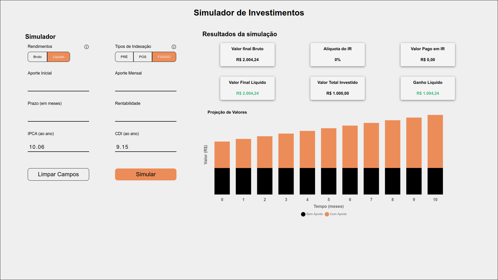

<div align="center">
 
</div>

<br>

# Desafio EQI - Simulador de Investimentos
Este projeto faz parte do processo seletivo iniciado pela EQI - investimentos e tem como base os requisitos e wireframes apresentados pela empresa.

<br>

## 📝 Tabela de Conteúdos
---
- [Sobre](#Sobre)
- [Getting Started](#getting_started)
- [Deployment](#deployment)
- [Usage](#usage)
- [Built Using](#built_using)
- [Authors](#authors)
- [Acknowledgments](#acknowledgement)

<br>

## 🧐 Sobre 
---

Este repositório contem um simulador de investimentos que permitir ao usuário realizar uma simulação de rendimentos de acordo com o tipo de indexação e tipo de rendimento escolhido. 
O projeto faz parte do processo seletivo iniciado pela EQI - investimentos e tem como base os requisitos e wireframes apresentados pela empresa.

<br>

## 🏁 Como Executar
---
## Download
#### Terminal:
```shell 
git clone https://github.com/FelipeJozala/desafio-eqi.git
```
ou faça o download do repositorio:

[Simulador de Investimentos (ZIP)](https://github.com/eqi-investimentos/desafio-fake-api/archive/refs/heads/main.zip)
## Instalação
```shell 
npm i 
```
## Executar o Servido (Fake-API)
```shell 
npm run server
```
A Fake-API estara disponível em `localhost:8080`

## Executar o App
```shell 
npm start
```
o App estara disponível em `localhost:3000`

<br>

## ⛏️ Ferramentas Utilizadas <a name = "built_using"></a>
---
- [React](https://pt-br.reactjs.org/)
- [JSON Server](https://www.npmjs.com/package/json-server) 
- [Styled Components](https://styled-components.com/)
- [React-hook-form](https://react-hook-form.com/)
- [Axio](https://axios-http.com/docs/intro)
- [Chartjs](https://www.chartjs.org/)
- [Yup](https://github.com/jquense/yup)
- [Axio](https://axios-http.com/docs/intro)

<br>
