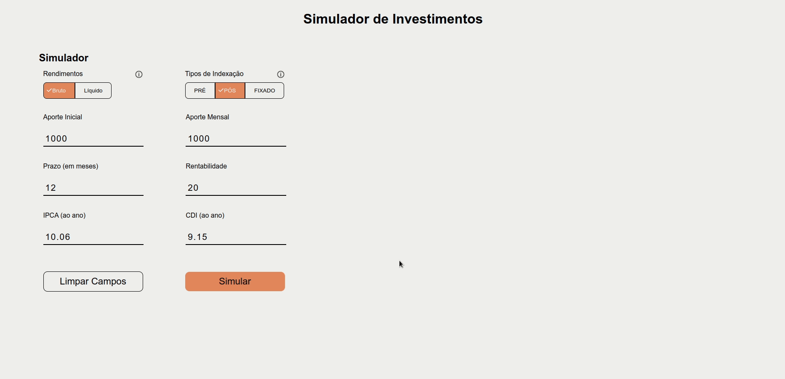
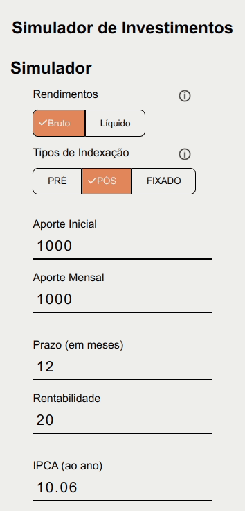

# Desafio EQI - Simulador de Investimentos
Este projeto faz parte do processo seletivo iniciado pela EQI - investimentos e tem como base os requisitos e wireframes apresentados pela empresa.
 
<br>
 
## Demonstração
<div align="center">


 
<br>
 
## [Ver o projeto](https://frontend-eqi.herokuapp.com/)
 
</div>
<br>
 
## Tabela de Conteúdos
 
- [Sobre](#sobre)
- [Rodando localmente](#executar)
- [Hooks e Components](#components)
 	- [Hooks](#hooks)
    	- [UseApi](#api)
    	- [UseIndicateursApi](#indicateurs)
 	- [Components](#comp)
    	- [ButtonsGroup](#group)
    	- [Label and Tooltip](#tooltip)
- [Ferraments utilizadas](#tools)
 
<br>
 
## Sobre <a name = "sobre"></a>
Este repositório contém uma aplicação web que tem como principal objetivo, realizar uma simulação de rendimentos baseado em parâmetros escolhidos pelo usuário.
O escopo do projeto não inclui a geração de dados reais, estes são carregados de uma API e representam uma projeção fictícia.
O projeto faz parte do processo seletivo iniciado pela EQI - investimentos e tem como base os requisitos e wireframes apresentados pela empresa.
 
<br>
 
## Rodando localmente <a name = "executar"></a>
<br>
 
### Download <a name = "download"></a>
```bash
git clone https://github.com/FelipeJozala/desafio-eqi.git
```
ou faça o download do repositório:  [Simulador de Investimentos (ZIP)](https://github.com/FelipeJozala/desafio-eqi/archive/refs/heads/master.zip)
 
<br>
 
### Entre no diretório do projeto:
```bash
cd desafio-eqi
```
### Instale as dependências
```bash
npm install
```
### Inicie a aplicação
```bash
npm start
```
o App estará disponível em `localhost:3000` e a Fake-API estará em `localhost:3001`
<br>
## Hooks e Components <a name = "components"></a>
Custom hooks e componentes desenvolvidos para esta aplicação.
<br>
### Hooks <a name = "hooks"></a>
#### useApi <a name = "api"></a>
Custom hook que recebe um objeto com os parâmetros a serem filtrados em `/simulacoes`
```javascript
import useApi from './hooks/useApi'
{ ApiData, ApiError, ApiLoading, setApi } = useApi()
let params = {
        revenu: '', //tipoRendimento
        indexType: '' //tipoIndexacao
    }
setApi(params)
```
| Parâmetro   | Tipo       | Descrição                           |
| :---------- | :--------- | :---------------------------------- |
| `setApi ` | `object` | define os parâmetros da chamada a Api, retorna `{ ApiData, ApiError, ApiLoading }` |
| `ApiData` | `object` | Retorna os resultados da simulação |
| `ApiError` | `object` | Retorna os erros da chamada da Api, caso ocorram |
| `ApiLoading` | `boolean` | Retorna os `true` durante a chamada a Api e posteriormente `false`  |
#### useIndicateursApi <a name = "indicateurs"></a>
Custom hook que realiza a chamada a `/indicadores`, não aceita parâmetros e é carregado junto com a aplicação.
```javascript
import useIndicateursApi from './hooks/useIndicateursApi'
{ apiIndicators, error, loadingIndicators} = useIndicateursApi()
```
| Parâmetro   | Tipo       | Descrição                           |
| :---------- | :--------- | :---------------------------------- |
| `apiIndicators` | `object` | Retorna os resultados da simulação |
| `error` | `object` | Retorna os erros da chamada da Api, caso ocorram |
| `loadingIndicators` | `boolean` | Retorna os `true` durante a chamada a Api e posteriormente `false`  |

<br>

### Components <a name = "comp"></a>

#### ButtonsGroup <a name = "group"></a>
Recebe um array de objetos com os atributos `name` e `value` e retorna um grupo de botões.
```javascript
import ButtonsGroup from '../buttons-group/ButtonsGroup'
const buttons = [
{name: 'PRÉ', value: 'pre'},
{name: 'PÓS',value: 'pos'},
{name: 'FIXADO',value: 'ipca'}
]
<ButtonsGroup buttons={buttons} initial={'PÓS'} action={ () => {} }/>
```
| Parâmetro   | Tipo       | Descrição                           |
| :---------- | :--------- | :---------------------------------- |
| `buttons` | `array` | Recebe um array com os dados dos botões |
| `initial` | `string` | Seleciona o botão considerado como `default`, usa como referência o parâmetro `name` |
| `action` | `function` | Recebe uma `function` que é executada em `onClick`  |

<br>

#### Label + Tooltip <a name = "tooltip"></a>
```javascript
import Label from '../label/Label'
<Label text='Rendimentos' hasTooltip tooltip='Lorem ipsum dolor sit amet.'/>
```
| Parâmetro   | Tipo       | Descrição                           |
| :---------- | :--------- | :---------------------------------- |
| `text` | `string` | Texto exibido como `label` |
| `hasTooltip` | `none` | Se presente, adiciona o ícone de Informação |
| `tooltip` | `string` | Texto exibido quando em `hover` sobre o ícone de Informação  |
 
<br>
 
## Ferramentas utilizadas <a name = "tools"></a>
 
- [React](https://pt-br.reactjs.org/)
- [JSON Server](https://www.npmjs.com/package/json-server)
- [Styled Components](https://styled-components.com/)
- [React-hook-form](https://react-hook-form.com/)
- [Axios](https://axios-http.com/docs/intro)
- [Chartjs](https://www.chartjs.org/)
- [Yup](https://github.com/jquense/yup)

<br>
 
 
 

